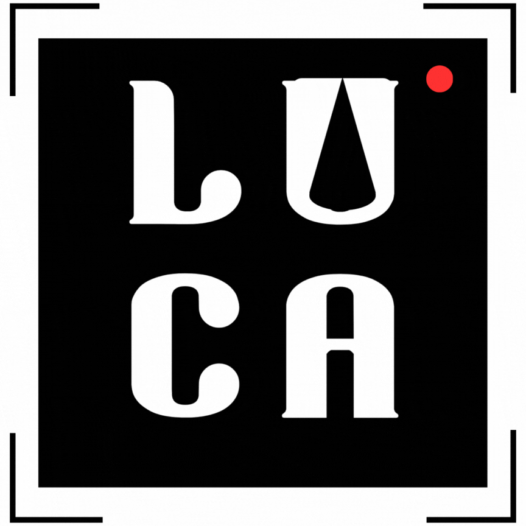

<h1 align="center">Revista Digital LUCA</h1>

<p align="center">
  
  
  
</p>

<p align="center">
  
</p>

## 📌 Sobre o Projeto

Este projeto é um site de reportagens interativo que exibe matérias organizadas em um layout dinâmico, sobre o cinema independente nacional.
As reportagens possuem imagens clicáveis que direcionam para o conteúdo completo.

<!--## Tecnologias Utilizadas

 
 
 

## 📁 Estrutura do Projeto

```bash
📂 LUCA
├── 📂 css                    # Arquivos de estilo (CSS)
├── 📂 docs                   # Imagens e recursos
├── 📂 js                     # Arquivos JavaScript
├── 📄 home.html              # Página inicial
├── 📄 abertura.html          # Abertura do site
├── 📄 assinatura.html        # Página de assinatura da revista
├── 📄 cadastrar.html         # Página de cadastro no site
├── 📄 login.html             # Página ed login
├── 📄 pagamento.html         # Página de pagamentos
├── 📄 reportagens.html 
├── 📄 sobre.html             # Página de apresentação
├── 📄 streaming.html         # Página de streaming
├── 📄 materias[numero].html  # Página das matérias
└── 📄 README.md              # Documentação
```

## Layout

A página exibe:
- Uma **logo centralizada** na parte superior.
- Uma **imagem de fundo** que ocupa a mesma seção da logo.
- **Cards de matérias** organizados em uma grade responsiva.

## 📌 Como Executar Localmente


1. Clone este repositório:
   ```bash
   git clone https://github.com/GerlianeChaves/RevistaLuca.git
   ```
2. Acesse a pasta do projeto:
   ```bash
   cd RevistaLuca
   ```
3. Abra o arquivo `home.html` no navegador.

## LUCA


<!--<p align="center">
  
</p>-->

Você pode acessar em: https://revistaluca.netlify.app/ 

## Melhorias Futuras

- [ ] Implementar banco de dados para adicionar novas matérias dinamicamente.
- [ ] Melhorar a responsividade para dispositivos móveis.
- [ ] Adicionar animações para transições mais fluidas.

---


